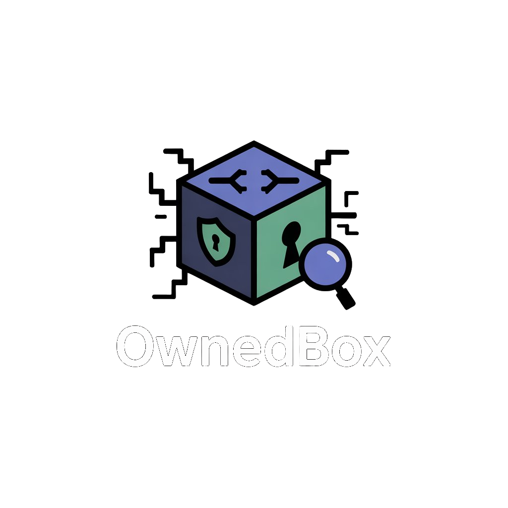

<!-- ╔══════════════════════════════════════════════════════════════╗ -->
<!--   OwnedBox · Landing page (README)                               -->
<!--   Tema: dark #121c21 · acento #1294d4 · fonte Space Grotesk      -->
<!-- ╚══════════════════════════════════════════════════════════════╝ -->

<div align="center">



<h1>OwnedBox</h1>

<p><strong>Plataforma de laboratórios práticos de segurança ofensiva.</strong><br/>
Aprenda explorando vulnerabilidades reais — <em>SQL Injection</em>, <em>XSS</em> e <em>File Upload</em> — em um ambiente controlado.</p>

<p>
  
  
  
  
  
</p>

</div>

---

## 🎯 Sobre o projeto

O **OwnedBox** é uma plataforma de treinamento em segurança da informação construída em **Laravel**. Cada módulo coloca o usuário diante de uma aplicação propositalmente vulnerável: o objetivo é **gerar uma vítima**, explorar a falha, capturar o token de prova e validá-lo para concluir o laboratório.

A interface acompanha o progresso de cada usuário, mostrando módulos concluídos e percentual de conclusão no perfil.

> ⚠️ **Aviso de segurança**
> Este projeto contém código **intencionalmente vulnerável** para fins **educacionais**. Use apenas em ambiente local/isolado. **Nunca** exponha esta aplicação na internet pública.

---

## 🧪 Laboratórios disponíveis

| Módulo | Vulnerabilidade | Rota | Status |
| :----- | :-------------- | :--- | :----: |
| 💉 **SQL Injection** | Injeção de SQL em formulário de login | `/sql` | ✅ |
| 🔓 **Cross-Site Scripting** | XSS refletido / via cookie | `/xss` | ✅ |
| 📁 **File Upload** | Upload de arquivo sem validação | `/fileupload` | ✅ |

Cada laboratório expõe dois endpoints unificados:

- `POST /lab/{lab}/generate-victim` — gera uma vítima para o cenário
- `POST /lab/{lab}/validate-token` — valida o token de conclusão

---

## 🛠️ Stack

- **Backend:** PHP 8.3 · Laravel 13 · Laravel Tinker
- **Banco:** SQLite (padrão, zero configuração)
- **Frontend:** Blade · Bootstrap · Vite · Tailwind 4 · fonte *Space Grotesk*
- **Qualidade:** Pint · PHPUnit · Pail (logs em tempo real)

---

## ✅ Pré-requisitos

Antes de começar, garanta que você tem instalado:

- [PHP **8.3+**](https://www.php.net/downloads) com as extensões `pdo_sqlite`, `mbstring`, `openssl` e `xml`
- [Composer 2](https://getcomposer.org/)
- [Node.js **18+**](https://nodejs.org/) e npm

---

## 🚀 Instalação rápida

Clone o repositório e rode o setup automatizado — ele instala dependências, cria o `.env`, gera a chave da aplicação, roda as migrations e compila os assets:

```bash
# 1. Clone o repositório
git clone https://github.com/<seu-usuario>/Ownedbox.git
cd Ownedbox

# 2. Setup completo em um comando
composer run setup

# 3. (opcional) Popule o banco com um usuário de teste
php artisan db:seed

# 4. Suba o ambiente de desenvolvimento (server + queue + logs + vite)
composer run dev
```

Acesse 👉 **http://localhost:8000**

<div align="center">

| Usuário de teste (após `db:seed`) | Valor |
| :-- | :-- |
| **E-mail** | `test@example.com` |
| **Senha** | `password` |

</div>

---

<details>
<summary><strong>🔧 Instalação manual (passo a passo)</strong></summary>

<br/>

Se preferir entender cada etapa em vez de usar o `composer run setup`:

```bash
# Dependências PHP
composer install

# Crie o arquivo de ambiente
cp .env.example .env

# Gere a chave da aplicação
php artisan key:generate

# Crie o banco SQLite e rode as migrations
touch database/database.sqlite
php artisan migrate

# (opcional) Dados de teste
php artisan db:seed

# Dependências e build do frontend
npm install
npm run build

# Inicie o servidor
php artisan serve
```

</details>

<details>
<summary><strong>⚙️ Configuração do <code>.env</code></strong></summary>

<br/>

O projeto já vem pronto para rodar com **SQLite** sem configuração extra. As principais variáveis:

```env
APP_NAME=OwnedBox
APP_ENV=local
APP_DEBUG=true
APP_URL=http://localhost:8000

# Banco padrão: SQLite (arquivo local, nada para configurar)
DB_CONNECTION=sqlite

# Sessão / cache / filas usam o banco
SESSION_DRIVER=database
CACHE_STORE=database
QUEUE_CONNECTION=database
```

> 💡 Quer usar **MySQL/PostgreSQL**? Troque `DB_CONNECTION` e descomente/preencha
> `DB_HOST`, `DB_PORT`, `DB_DATABASE`, `DB_USERNAME` e `DB_PASSWORD` no `.env`.

</details>

<details>
<summary><strong>📂 Estrutura do projeto</strong></summary>

<br/>

```
Ownedbox/
├── app/Http/Controllers/   # AuthController, UserController, LabController
├── resources/
│   ├── views/              # Blade: login, menu, perfil, sql, xss, fileupload
│   └── css/                # styles, menu, modulo, perfil (tema OwnedBox)
├── routes/web.php          # Rotas de auth, menu, perfil e laboratórios
├── database/
│   ├── migrations/         # Esquema do banco
│   └── seeders/            # Usuário de teste
└── public/img/             # Logo e assets estáticos
```

</details>

---

## 🧰 Comandos úteis

```bash
composer run dev     # server + queue + logs + vite, tudo junto
composer run test    # roda a suíte de testes (PHPUnit)
php artisan migrate  # aplica migrations
npm run dev          # apenas o Vite em modo watch
./vendor/bin/pint    # formata o código (estilo Laravel)
```

---

## 🤝 Contribuindo

1. Faça um *fork* do projeto
2. Crie sua branch: `git checkout -b feature/minha-feature`
3. Commit: `git commit -m "feat: minha feature"`
4. Push: `git push origin feature/minha-feature`
5. Abra um *Pull Request*

---

## 📜 Licença

Software livre distribuído sob a licença **MIT**. Você pode usar, copiar, modificar e distribuir o projeto livremente, inclusive para fins comerciais, mantendo o aviso de copyright original. Veja o arquivo [LICENSE](LICENSE) para o texto completo.

<div align="center">
<sub>Feito com 💙 · <strong>OwnedBox</strong></sub>
</div>
